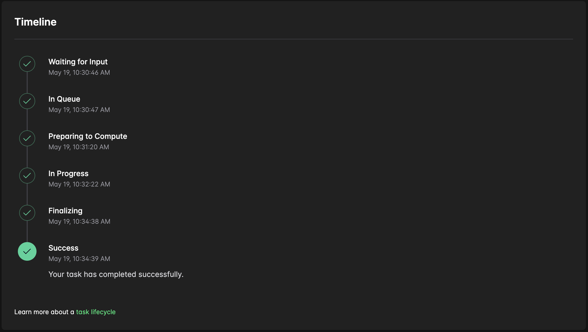

# Run a Single Simulation
First, we will run a single TurbSim simulation using the `90m_12mps_twr.inp`
case. This should be straightforward as all the necessary input files are
already prepared, as described in the previous section.

## Code Overview
The Python code required to run a TurbSim simulation using the Inductiva API follows a consistent structure. We adapted it for this specific use case, as shown below.

```python
import inductiva

# Allocate cloud machine on Google Cloud Platform
cloud_machine = inductiva.resources.MachineGroup( \
    provider="GCP",
    machine_type="n2-highcpu-2",
    spot=True)

# Initialize OpenFast stack, which includes TurbSim
turbsim = inductiva.simulators.OpenFAST()

# Run TurbSim command on the 90m_12mps_twr.inp input file
task = turbsim.run( \
    input_dir="input_files/",
    commands=["turbsim 90m_12mps_twr.inp"],
    on=cloud_machine)

# Wait for the simulation to finish and download the results
task.wait()
cloud_machine.terminate()

task.download_outputs()

task.print_summary()
```

When the simulation is complete, we terminate the machine, download the results and print a summary of the simulation as follows.

```
Task status: Success

Timeline:
        Waiting for Input         at 19/05, 10:30:46      1.078 s
        In Queue                  at 19/05, 10:30:47      33.417 s
        Preparing to Compute      at 19/05, 10:31:20      61.376 s
        In Progress               at 19/05, 10:32:22      136.385 s
                └> 136.186 s       turbsim 90m_12mps_twr.inp
        Finalizing                at 19/05, 10:34:38      0.655 s
        Success                   at 19/05, 10:34:39

Data:
        Size of zipped output:    8.16 MB
        Size of unzipped output:  8.39 MB
        Number of output files:   6

Total estimated cost (US$): 0.0110 US$
	Estimated computation cost (US$): 0.0010 US$
	Task orchestration fee (US$): 0.010 US$

Note: A per-run orchestration fee (0.010 US$) applies to tasks run from 01 Dec 2025, in addition to the computation costs.
Learn more about costs at: https://inductiva.ai/guides/how-it-works/basics/how-much-does-it-cost
```

You can also visit the [Inductiva Web Console](https://console.inductiva.ai/) to view task details, navigate
the task the filesystem, and monitor logs in real time.




## Performance and Cost Analysis
Given that TurbSim does not benefit from multiple CPU cores, we chose the `n2-highcpu-2` virtual machine (VM) with 2 virtual CPUs (equivalent to 1 physical core).
This is one of the cheapest options on Google Cloud, costing just US$0.0081 per hour in spot mode.

In the next part of this tutorial, we'll take things to the next level by running dozens of TurbSim simulations in parallel on Inductiva, demonstrating
the true power of cloud-based scalability. Stay tuned!
